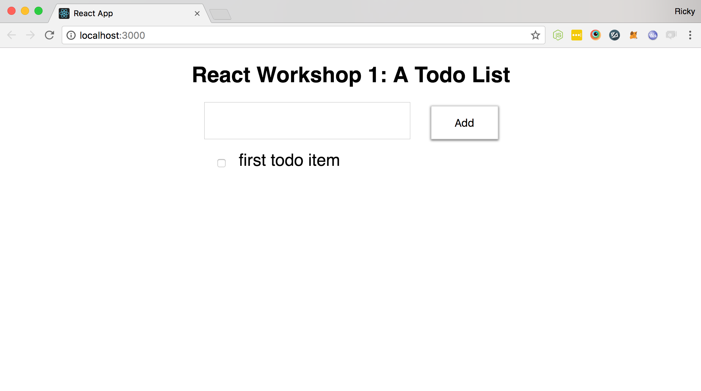

## React Workshop 1

### Introduction
This project was bootstrapped with [Create React App](https://github.com/facebookincubator/create-react-app).

**Goal**: the purpose of this app is to breakdown a small todo list UI into components and
understand the presentation (stateless) vs smart component pattern

**Learning Objectives**: 
1. understand functional (stateless) and stateful components
2. understand a React pattern for separating presentational and "smart" components
3. learn some ES6 syntax

### Setup
If you have not already, please install:
* [Yarn](https://yarnpkg.com/en/docs/install)

1. Run `yarn install`.
2. Run `yarn start` and visit [locahost:3000](http://localhost:3000/) to see
   your appplication.

### Testing
This applications uses [Jest](https://facebook.github.io/jest/) for testing. To run the test suite, simply run:

`yarn test`

